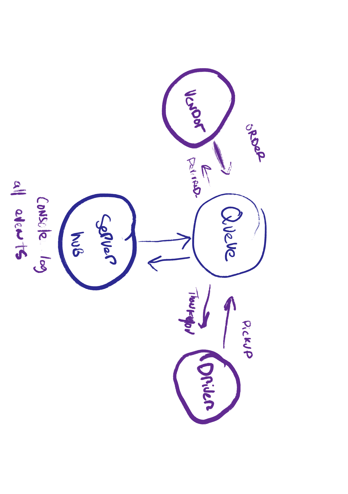

# Project Name
- Caps - Event Driven Application

# Author: Tek Jones

## start program
- npm start

## test
- npm run test

## Deployed Links:

# Phase 1

## About
- Build of an application for a company called CAPS - The Code Academy Parcel Service. Build out a system that emulates a real world supply chain. CAPS will simulate a delivery service where vendors (such a flower shops) will ship products using our delivery service and when our drivers deliver them, be notified that their customers received what they purchased. Tactically, this will be an event driven application that “distributes” the responsibility for logging to separate modules, using only events to trigger logging based on activity.

## Features and stories

* User
- As a vendor, I want to alert the system when I have a package to be picked up
- As a driver, I want to be notified when there is a package to be delivered
- As a driver, I want to alert the system when I have picked up a package and it is in transit
- As a driver, I want to alert the system when a package has been delivered
- As a vendor, I want to be notified when my package has been delivered

* Developer
- As a developer, I want to use industry standards for managing the state of each package
- As a developer, I want to create an event driven system so that I can write code that happens in response to events, in real time

## UML

# Phase 2

## About
- Changing the underlying networking implementation of our CAPS system from using node events to using a library called socket.io so that we can do networked events. This is where we’ll be creating a networking layer.

## Features and stories

* User
- As a vendor, I want to alert the system when I have a package to be picked up
- As a driver, I want to be notified when there is a package to be delivered
- As a driver, I want to alert the system when I have picked up a package and it is in transit
- As a driver, I want to alert the system when a package has been delivered
- As a vendor, I want to be notified when my package has been delivered

* Developer
- As a developer, I want to create network event driven system using Socket.io so that I can write code that responds to events originating from both servers and web applications

## UML

# Phase 3

## About
- Build a set of applications to manage deliveries made by CAPS Drivers. This will simulate a delivery driver delivering a package and scanning the package code. Retailers will be able to see in their dashboard or log, a list of all packages delivered in real time. Should a delivery driver deliver many packages while the retailer is not connected to the dashboard, the retailer should be able to “catch up” and see a list of all missed events before resuming real-time monitoring.

## Features and stories

* User
- As a vendor, I want to “subscribe” to “delivered” notifications so that I know when my packages are delivered.
- As a vendor, I want to “catch up” on any “delivered” notifications that I might have missed so that I can see a complete log
- As a driver, I want to “subscribe” to “pickup” notifications so that I know what packages to deliver
- As a driver, I want to “catch up” on any “pickup” notifications I may have missed so that I can deliver everything.
- As a driver, I want a way to “scan” a delivery so that the vendors know when a package has been delivered.

* Developer
- As a developer, I want to create a system of tracking who is subscribing to each event
- As a developer, I want to place all inbound messages into a “queue” so that my application knows what events are to be delivered.
- As a developer, I want to create a system for communicating when events have been delivered and received by subscribers.
- As a developer, I want to delete messages from the queue after they’ve been received by a subscriber, so that I don’t re-send them
- As a developer, I want to create a system for allowing subscribers to retrieve all undelivered messages in their queue

## UML

