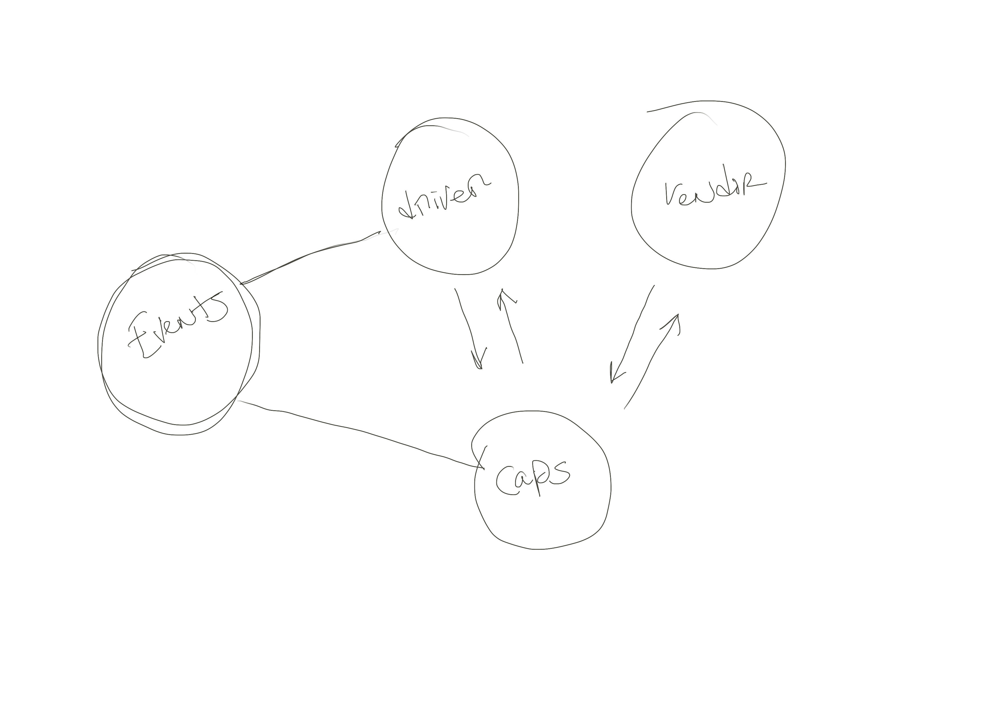
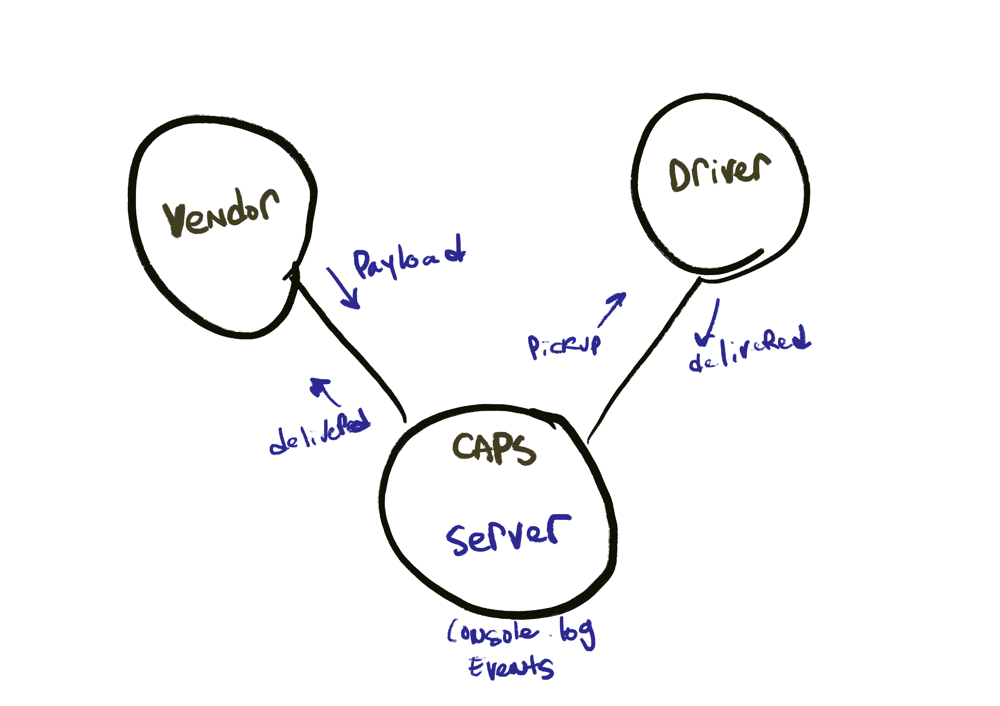

# Project Name
- Caps - Event Driven Application

# Author: Tek Jones

## start program
- npm start

## test
- npm run test

## Deployed Links:

# Phase 1

## About
- Build of an application for a company called CAPS - The Code Academy Parcel Service. Build out a system that emulates a real world supply chain. CAPS will simulate a delivery service where vendors (such a flower shops) will ship products using our delivery service and when our drivers deliver them, be notified that their customers received what they purchased. Tactically, this will be an event driven application that “distributes” the responsibility for logging to separate modules, using only events to trigger logging based on activity.

## Features and stories

* User
- As a vendor, I want to alert the system when I have a package to be picked up
- As a driver, I want to be notified when there is a package to be delivered
- As a driver, I want to alert the system when I have picked up a package and it is in transit
- As a driver, I want to alert the system when a package has been delivered
- As a vendor, I want to be notified when my package has been delivered

* Developer
- As a developer, I want to use industry standards for managing the state of each package
- As a developer, I want to create an event driven system so that I can write code that happens in response to events, in real time

## UML

# Phase 2

## About
- Changing the underlying networking implementation of our CAPS system from using node events to using a library called socket.io so that we can do networked events. This is where we’ll be creating a networking layer.

## Features and stories

* User
- As a vendor, I want to alert the system when I have a package to be picked up
- As a driver, I want to be notified when there is a package to be delivered
- As a driver, I want to alert the system when I have picked up a package and it is in transit
- As a driver, I want to alert the system when a package has been delivered
- As a vendor, I want to be notified when my package has been delivered

* Developer
- As a developer, I want to create network event driven system using Socket.io so that I can write code that responds to events originating from both servers and web applications

## UML
